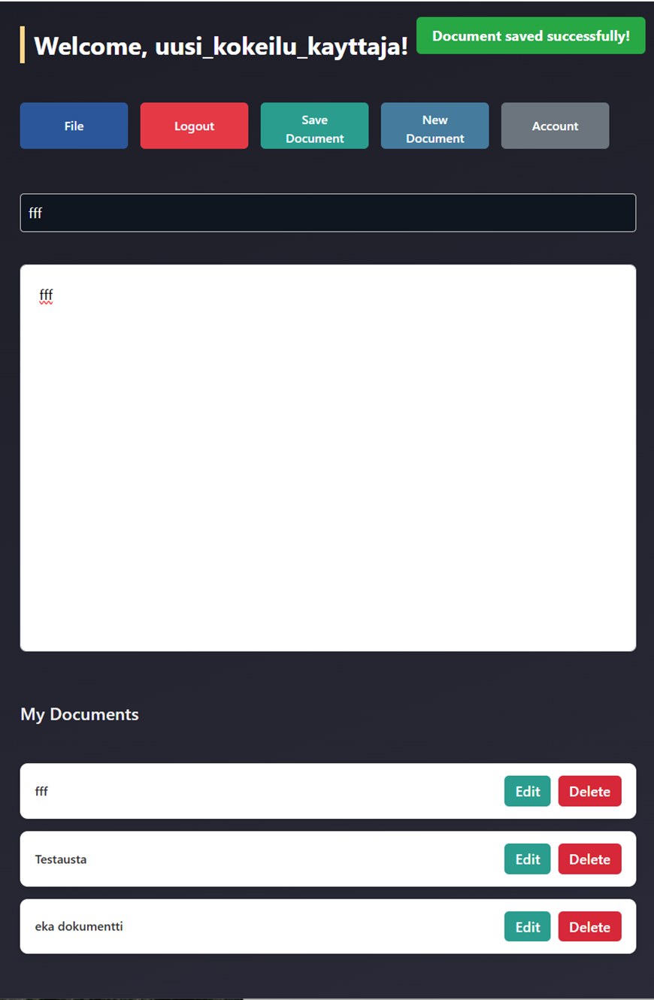

# Text Editor App

### A simple text editor web application with CRUD operations and user authentication. Users can create, view, edit, and delete documents after signing up and logging in.

## Features

- ### Document Management:

- ### Create documents

- ### View documents

- ### Delete documents

## Authentication:

- ### Signup

- ### Login

## Tech Stack

- ### Frontend: React

- ### Backend: Node.js, Express

- ### Database: MySQL (XAMMP)

## Prerequisites

- ## Node.js v18+

- ## MySQL installed and running

## Setup Instructions

### Backend Setup

- Install dependencies:

```cmd
cd backend
npm install
```

## Configure database:

### Create a MySQL database

Update .env with your MySQL credentials

## Start the backend server:

```cmd
node server.js
```

### Frontend Setup

- Install dependencies:

```cmd
cd frontend
npm install
```

## Start the frontend:

```cmd
npm run dev
```

- Open your browser at http://localhost:5173

```sql
## Database Schema
Table	Columns
users	id, username, email, password
documents	id, user_id, title, content, created_at, updated_at
```

## Screenshots

### Dashboard showing all user documents


